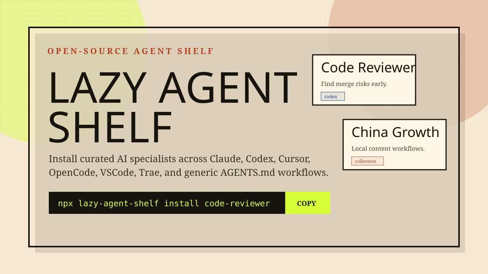

# Lazy Agent Shelf

[](https://github.com/ElevenZhou/lazy-agent-shelf/actions/workflows/validate.yml)
[](https://github.com/ElevenZhou/lazy-agent-shelf/actions/workflows/pages.yml)
[](https://elevenzhou.github.io/lazy-agent-shelf/)
[](LICENSE)



Lazy Agent Shelf is an open-source cross-tool agent and skill library. It lets users install curated expert agents once and export them to Claude Code, Codex, Cursor, OpenCode, VSCode Copilot, Trae, and generic AGENTS.md workflows.

The goal is simple: people are lazy, but good preset agents are powerful. This project turns agent prompts into versioned, reusable, testable, and portable assets.

## What This Repo Provides

- A universal `agent.yaml` source format for agent metadata.
- High-quality `prompt.md` files with scope, workflow, safety boundaries, and outputs.
- A CLI prototype to list, lint, build, and install agents.
- Multi-target generators for Claude Code, Codex skills, Cursor rules, OpenCode agents, VSCode Copilot instructions, Trae-style prompts, and generic AGENTS.md bundles.
- A website prototype for browsing and recommending agents.
- A usage guide for where the generated agents actually run: `docs/usage.md`.

## Quick Start

```bash
npm install
npm run catalog
npm run lint:agents
npm run build:agents
node packages/cli/bin/lazy-agent-shelf.js list
node packages/cli/bin/lazy-agent-shelf.js install code-reviewer --target codex --out ./generated/install
node packages/cli/bin/lazy-agent-shelf.js install-collection solo-founder-pack --target cursor --out ./generated/install
node packages/cli/bin/lazy-agent-shelf.js install-collection code-quality-pack --target all --out ./generated/all-tools
```

After publishing to npm, the intended command shape is:

```bash
npx lazy-agent-shelf list
npx lazy-agent-shelf install code-reviewer --target codex
npx lazy-agent-shelf install-collection solo-founder-pack --target cursor
npx lazy-agent-shelf install-collection code-quality-pack --target all
```

## Agent Source Layout

```text
agents/<category>/<agent-id>/
  agent.yaml
  prompt.md
  examples.md

collections/<collection-id>/
  collection.yaml
```

`agent.yaml` is the portable source of truth. Generated platform files should not be edited by hand.

## Initial Collections

- `solo-founder-pack`: product, UI, API, copy, SEO, and social launch support.
- `code-quality-pack`: review, debugging, testing, security, and repo onboarding.
- `china-growth-pack`: Xiaohongshu, WeChat, Feishu, ecommerce, and market research.
- `agent-maker-pack`: agent quality, prompt-injection safety, and packaging.
- `data-ops-pack`: data analysis, spreadsheets, backtests, and automation.

## Initial Targets

- `claude`: Claude Code subagent Markdown
- `codex`: Codex skill `SKILL.md`
- `cursor`: Cursor `.mdc` rule
- `opencode`: OpenCode agent Markdown
- `vscode`: GitHub Copilot instruction Markdown
- `trae`: Trae-compatible prompt Markdown
- `generic`: AGENTS.md section

## Project Principles

- Quality beats raw count.
- Every agent must have a clear scope and non-scope.
- Every agent must define expected outputs and safety boundaries.
- One source format should compile into multiple AI tools.
- Chinese and global workflows should both be first-class.

## Roadmap

See `docs/roadmap.md`.

## Recent Updates

- 2026-05-10: Added website language switching for English and Chinese, with localized agent and collection summaries in the generated catalog.

